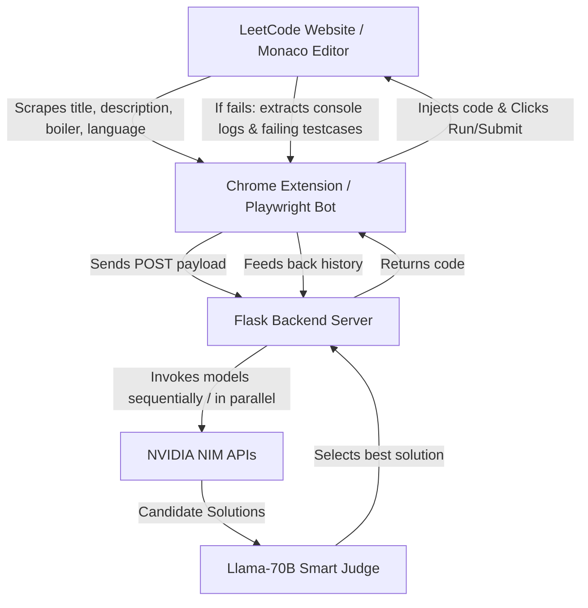

# ⚡ LeetCode-NVIDIA-AUTO 🤖
> A highly resilient, dynamic, and multi-lingual browser automation suite that automatically solves LeetCode problems using NVIDIA NIM (AI Chat Completions) & Llama-based judging with multi-model evolution.

[](https://opensource.org/licenses/MIT)
[](https://www.python.org/)
[](#)

LeetCode-NVIDIA-AUTO automatically solves LeetCode questions by scraping problem statements, querying cutting-edge AI models, injecting code directly into Monaco editor panels, running tests, analyzing compilation/runtime errors or wrong answers, and feeding failures back to models to "evolve" a working solution.

---

## 🌟 Key Features

1. **🤖 Multi-Language Auto-Detection**: Dynamically queries LeetCode's active Monaco editor model (`cpp`, `python`, `javascript`, `java`, `go`, `rust`, etc.). Solves problems automatically in whatever language your LeetCode website is set to.
2. **🔄 Sequential Model Rotation & Failover**: Rotates through 5+ state-of-the-art coding and reasoning models (DeepSeek V3, Qwen 3 Coder 480B, Llama 3.1 Nemotron 253B, etc.) automatically upon timeout, rate-limits, or repeated failures.
3. **🧬 Multi-Model Evolution (Learning from Mistakes)**: Feeds all previous failure histories (logs, compiler errors, failing inputs/expected outputs) into subsequent models, ensuring that each new attempt learns from past mistakes.
4. **⚖️ Llama-70B Smart Judge**: Orchestrates and compares solutions from multiple models, employing a `meta/llama-3.3-70b-instruct` judging layer to choose the most correct, efficient, and complete code.
5. **🎯 Double-Agent Automation Architecture**:
   - **Chrome Extension**: Adds an **"🤖 AI Solve"** button directly to your standard browser page Navbar with a real-time blur HUD, auto-running, auto-submitting, and auto-skipping.
   - **Playwright Bot**: An independent bulk solver script that launches a persistent headful Chrome instance to solve problems sequentially in a hands-free environment.
6. **🛡️ Safe & Security-Oriented**: Hardened with strict `.gitignore` filters to block accidental git leaks of active login sessions/cookies (`chrome_data/`) and private `.env` API keys.

---

## 🧬 Architecture Diagram



---

## 🛠️ Installation & Setup

### Prerequisites
- **Python 3.8+** installed on your system.
- A modern web browser (Google Chrome or Chromium-based) for Chrome Extension installation.
- An **NVIDIA NIM API Key** (Free keys available at [NVIDIA Build](https://build.nvidia.com/)).

---

### Step 1: Clone the Repository
```bash
git clone https://github.com/ik123a/leetcode-nvidia-auto.git
cd leetcode-nvidia-auto
```

### Step 2: Configure Environment Keys
Navigate to the `backend/` folder, copy the example template, and add your API keys:
```bash
cd backend
cp .env.example .env
```
Open `backend/.env` in a text editor and add your NVIDIA API key:
```env
NVIDIA_API_KEY="nvapi-YOUR_NVIDIA_API_KEY_HERE"
```

---

### Step 3: Start the Backend Server

Start the virtual environment and Flask server automatically based on your operating system:

#### 💻 On Windows:
Double-click `start_backend.bat` or run:
```cmd
start_backend.bat
```

#### 🍎 On macOS / 🐧 Linux:
Make the shell script executable and run it:
```bash
chmod +x start_backend.sh start_bot.sh
./start_backend.sh
```

---

### Step 4: Install the Chrome Extension

1. Open your browser and navigate to `chrome://extensions/`.
2. Toggle the **"Developer mode"** switch in the top-right corner.
3. Click the **"Load unpacked"** button in the top-left.
4. Select the `extension/` folder inside the cloned project directory.
5. The LeetCode-NVIDIA-AUTO logo ⚡ will appear in your extension toolbar!

---

## 🚀 How to Use

### Method A: Browser Extension (Recommended)
1. Open any LeetCode problem (e.g., [Two Sum](https://leetcode.com/problems/two-sum/)).
2. An **"🤖 AI Solve"** button will be automatically injected in the top right navbar.
3. Click the **⚡ LeetCode-NVIDIA-AUTO Extension Icon** in the toolbar to see the status panel:
   - **🤖 Auto-Mode**: Toggle this switch to let the extension automatically click "Run", inspect results, rotate models to fix compilation errors/Wrong Answers, click "Submit", and automatically click "Next Question" to solve the entire LeetCode catalog in the background!
   - **HUD**: A beautiful, translucent HUD in the top right tracks the active model name, countdown timers, failover counts, and progress status.

### Method B: Headless Playwright Bot (Bulk Solver)
To solve problems in a dedicated automation browser instance without using your personal browser window:

#### 💻 On Windows:
Double-click `start_bot.bat` or run:
```cmd
start_bot.bat
```

#### 🍎 On macOS / 🐧 Linux:
Run:
```bash
./start_bot.sh
```
1. A headful Chromium browser window will open.
2. **Log into LeetCode** in that browser window within the first 15 seconds.
3. The bot will automatically take over, navigating sequentially through unresolved problems, querying models, compiling code, learning from failures, submitting, and progressing.

---

## 🛡️ Security & Privacy Notice (CRITICAL)

When open-sourcing or committing this repository to GitHub:
- **NVIDIA API Keys**: Never commit your `backend/.env` file. It is protected by `.gitignore` by default.
- **Active Sessions (`chrome_data/`)**: The Playwright bot stores cookie sessions and login states in the `playwright_bot/chrome_data/` directory so you don't have to log in every time. **NEVER** force-commit this folder to GitHub. It contains active session keys that could allow anyone to hijack your LeetCode account. This directory is strictly blocked in `.gitignore`.

---

## 🛠️ Available AI Models
By default, the backend rotates through these premium NVIDIA-hosted NIM models optimized for maximum coding accuracy:
- **`deepseek-ai/deepseek-v3.2`** (State-of-the-art reasoning model)
- **`qwen/qwen3-coder-480b-a35b-instruct`** (Massive coder expert model)
- **`nvidia/llama-3.1-nemotron-ultra-253b-v1`** (Nemotron reasoning engine)
- **`qwen/qwen3.5-397b-a17b`** (Advanced multilingual reasoning)
- **`qwen/qwen2.5-coder-32b-instruct`** (Ultrafast coding failover)

---

## 📜 License
This project is licensed under the MIT License. See [LICENSE](LICENSE) for details.
